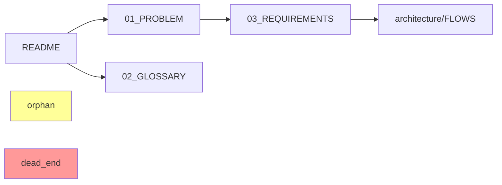

# Doc Validate Commands Reference

Справочник команд для Claude Code при выполнении `/doc:*` операций.

## Основные команды

### /doc:lint

**Цель**: Проверить форматирование и структуру документации.

**Алгоритм для Claude**:

1. Определить корень проекта (ищем `.git`, `.docvalidate.yml`, или используем pwd)
2. Запустить Ruby скрипт:
   ```bash
   SKILL_DIR=$(dirname "$(find ~/.claude -name "doc_validate.rb" -type f | head -1)")
   ruby "$SKILL_DIR/doc_validate.rb" lint --project="$(pwd)"
   ```
3. Для каждой найденной проблемы предложить интерактивное действие
4. Обновить историю в `.docvalidate/history.json`

**Проверки**:

| ID | Проверка | Приоритет |
|----|----------|-----------|
| LINT-001 | Битые внутренние ссылки | 🟢 info |
| LINT-002 | Нарушение naming conventions | 🟢 info |
| LINT-003 | Пустые секции | 🟢 info |
| LINT-004 | TODO/FIXME без ссылки на issue | 🟢 info |
| LINT-005 | Отсутствие обязательных секций | 🟡 warning |

**Автоисправления (fix)**:

| Проблема | Автоисправление |
|----------|-----------------|
| Битая ссылка | Предложить удалить или заменить |
| TODO без issue | Предложить создать GitHub issue |

### /doc:links

**Цель**: Построить граф связей и найти проблемы навигации.

**Алгоритм для Claude**:

1. Запустить скрипт:
   ```bash
   SKILL_DIR=$(dirname "$(find ~/.claude -name "doc_validate.rb" -type f | head -1)")
   ruby "$SKILL_DIR/doc_validate.rb" links --project="$(pwd)"
   ```
2. Визуализировать граф (опционально — Mermaid диаграмма)
3. Показать orphans и dead-ends
4. Рассчитать покрытие README навигации

**Проверки**:

| ID | Проверка | Приоритет |
|----|----------|-----------|
| LINK-001 | Orphan документ | 🟢 info |
| LINK-002 | Dead-end документ | 🟢 info |
| LINK-003 | Циклическая зависимость | 🟡 warning |
| LINK-004 | Низкое покрытие README | 🟡 warning |

**Визуализация графа**:



## Интерактивный режим

При обнаружении проблемы Claude ДОЛЖЕН предложить действия:

```
━━━━━━━━━━━━━━━━━━━━━━━━━━━━━━━━━━━━━━━━━━━━━━━━━━━
🟢 [LINT-001] Битая ссылка
━━━━━━━━━━━━━━━━━━━━━━━━━━━━━━━━━━━━━━━━━━━━━━━━━━━

📄 03_REQUIREMENTS.md:45
   > [см. архитектуру](architecture/MISSING.md)

❌ Файл не существует: architecture/MISSING.md

Действия:
[f] fix     — Удалить или заменить ссылку
[s] skip    — Пропустить
[i] ignore  — Добавить в .docignore
[e] edit    — Открыть файл в редакторе
[g] github  — Создать GitHub issue
[x] explain — Подробнее

Выберите действие:
```

### Реализация действий

**[f] fix**:
```ruby
# Для битой ссылки — предложить варианты:
# 1. Удалить ссылку, оставить текст
# 2. Заменить на правильный путь (fuzzy search)
# 3. Создать файл-заглушку
```

**[i] ignore**:
```bash
# Добавить в .docvalidate/.docignore
echo '{"id": "LINT-001", "file": "03_REQUIREMENTS.md", "reason": "User ignored", "created": "2025-01-30"}' >> .docvalidate/.docignore
```

**[e] edit**:
```bash
# Открыть в редакторе пользователя
$EDITOR +45 03_REQUIREMENTS.md
# или
code -g 03_REQUIREMENTS.md:45
```

**[g] github**:
```bash
# Создать GitHub issue
gh issue create \
  --title "[doc-validate] Битая ссылка в 03_REQUIREMENTS.md:45" \
  --body "Обнаружена битая ссылка:\n\nФайл: 03_REQUIREMENTS.md\nСтрока: 45\nСсылка: architecture/MISSING.md\n\nОбнаружено: doc-validate skill"
```

## Обработка ошибок

### Скрипт не найден
```bash
if ! find ~/.claude -name "doc_validate.rb" -type f | head -1 | grep -q .; then
  echo "Ошибка: doc_validate.rb не найден"
  echo "Переустановите skill: /install doc-validate"
  exit 1
fi
```

### Нет конфигурации
```
⚠️ Файл .docvalidate.yml не найден.
Используются настройки по умолчанию.

Создать конфигурацию? [y/n]
```

### Нет документов
```
ℹ️ Markdown файлы не найдены в текущей директории.
Проверьте scope в .docvalidate.yml
```

## Session Recovery

При прерывании (Ctrl+C) сохраняется состояние:

```json
// .docvalidate/session.json
{
  "started": "2025-01-30T10:30:00Z",
  "command": "lint",
  "processed": 15,
  "total": 24,
  "remaining_issues": ["LINT-003", "LINT-007"]
}
```

При следующем запуске:
```
Обнаружена незавершённая сессия от 10:30.
Продолжить с места остановки? [y/n]
```

## Метрики

После каждого запуска выводить:

```
📊 Метрики /doc:lint
━━━━━━━━━━━━━━━━━━━━━━━━━━━━━━━━

Проблемы:
  🔴 Критические:  0
  🟡 Важные:       2
  🟢 Информация:   8
  ─────────────────
  Всего:          10

Сравнение с прошлым запуском:
  🟡 -1 (было 3)
  🟢 +3 (было 5)
```

## Интеграция с Claude Code

### Как Claude должен вызывать

1. **Пользователь**: `/doc:lint`
2. **Claude**: Активировать skill doc-validate
3. **Claude**: Найти путь к скрипту
4. **Claude**: Выполнить `ruby doc_validate.rb lint`
5. **Claude**: Парсить вывод и предложить интерактивные действия
6. **Claude**: Для каждой проблемы спросить пользователя

### Пример сессии

```
User: /doc:lint

Claude: 🔍 Запускаю проверку форматирования документации...

[Выполняет скрипт, получает результат]

Claude: Найдено 3 проблемы:

━━━━━━━━━━━━━━━━━━━━━━━━━━━━━━━━━━━━━━━━━━━━━━━━━━━
🟢 [LINT-001] Битая ссылка
...

Что сделать с этой проблемой?
- [f] Исправить автоматически
- [s] Пропустить
- [i] Игнорировать навсегда

User: f

Claude: [Применяет исправление]

Ссылка удалена. Переходим к следующей проблеме...
```
