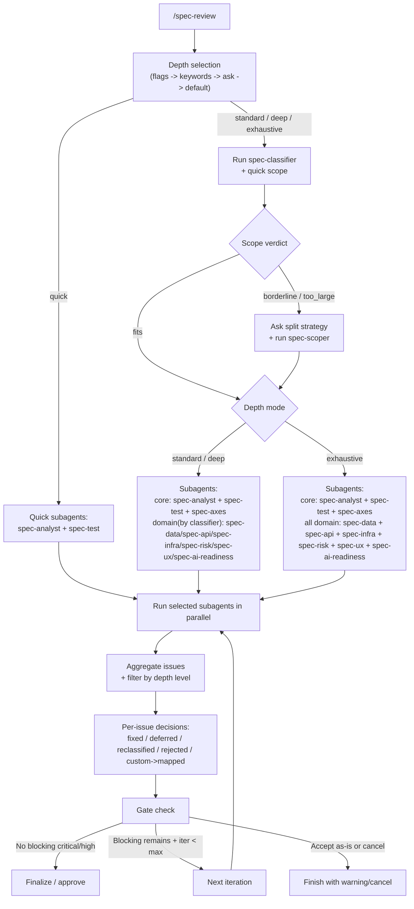
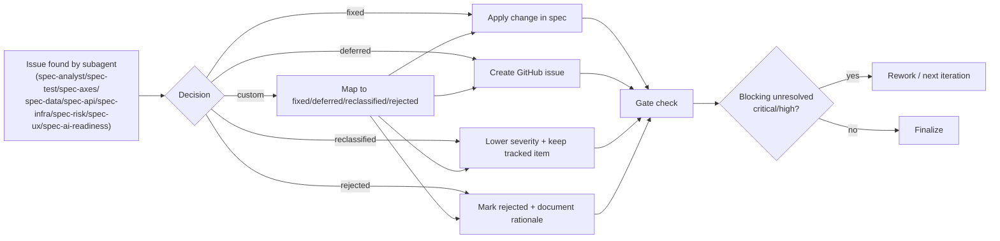

# spec-reviewer

Specification review plugin for Claude Code.
It helps you find gaps, contradictions, ambiguity, testability problems, and scope risks before implementation.

Russian version: [README.ru.md](./README.ru.md)

## Why Use It

Use `spec-reviewer` when you want to:
- reduce rework before coding starts,
- detect blockers early (critical/high issues),
- split oversized specs into implementable phases,
- keep a transparent decision trail for each remark.

## Install

```bash
/plugin install spec-reviewer@dapi
```

## Quick Start

```bash
/spec-reviewer:spec-review [--quick|-q|--standard|-s|--deep|-d|--exhaustive|-e|--no-ask] [Google Doc URL | GitHub Issue URL | Docmost URL | file path]
/spec-review docs/spec.md
/spec-review --quick #42
/spec-review --deep https://docs.google.com/document/d/<DOC_ID>/edit
/spec-review --standard https://docs.company.com/p/<PAGE_ID>
```

## Command Arguments Explained

Command shape:

```text
/spec-reviewer:spec-review [depth flag] [--no-ask] [source]
```

Depth resolution priority:
1. explicit depth flag (`--quick/--standard/--deep/--exhaustive`);
2. depth keywords in your message;
3. interactive depth question;
4. fallback to `standard`.

### Flags

| Flag | Meaning | Typical use |
|---|---|---|
| `--quick`, `-q` | Fast blocker check. Shows only `critical`, skips classifier and gate-check, runs only `spec-analyst` + `spec-test`. | Quick pre-check before coding starts. |
| `--standard`, `-s` | Default balanced review. Shows `critical` + `high`, uses classifier and gate-check. | Daily product/spec review workflow. |
| `--deep`, `-d` | Wider review window. Same agent strategy as Standard, but also includes `medium` issues. | Pre-release hardening or risky changes. |
| `--exhaustive`, `-e` | Full audit. Includes `low`, forces all domain agents, keeps classifier only for scope estimation. | Major architecture/integration checkpoints. |
| `--no-ask` | Do not ask the interactive "which level?" question. If no explicit depth flag is provided, run `standard` directly. | CI/non-interactive runs, scripted calls. |

Notes about `--no-ask`:
- It only affects depth selection UX (skips the question).
- It does not enable autopilot and does not auto-edit the spec.
- If you pass an explicit depth flag (for example `--deep --no-ask`), that explicit depth is used.

### Source Argument

`[source]` is one optional positional argument:

| Source | Accepted form | Example |
|---|---|---|
| Google Doc | full Google Docs URL | `https://docs.google.com/document/d/<DOC_ID>/edit` |
| GitHub Issue | full issue URL or short `#number` | `https://github.com/org/repo/issues/42`, `#42` |
| Docmost page | Docmost page URL | `https://docs.company.com/p/<PAGE_ID>` |
| Local file | relative or absolute path | `docs/spec.md` |

If no `[source]` is passed, you can paste spec text directly in chat and run review on that text.

## Inputs Supported

- Google Docs URL
- GitHub Issue URL or `#number`
- Docmost page URL (read via Docmost MCP)
- local file path
- large spec text pasted into chat

## Review Levels

| Level | Flags | Visible Severity (Focus) | Classifier | Agent Strategy | Gate Check | Max Iterations |
|---|---|---|---|---|---|---|
| Quick | `--quick`, `-q` | `critical` only (blockers) | skipped | only `spec-analyst` + `spec-test` | no | 1 |
| Standard (default) | `--standard`, `-s` | `critical`, `high` | yes | base + `spec-axes` + classifier-selected domain agents (+`spec-scoper` if needed) | yes | 2 |
| Deep | `--deep`, `-d` | `critical`, `high`, `medium` | yes | same as Standard, but wider reporting window | yes | 3 |
| Exhaustive | `--exhaustive`, `-e` | all, incl. `low` | yes (scope-only) | base + `spec-axes` + all domain agents (+`spec-scoper` if needed) | yes | 3 |

`--no-ask` behavior is described in detail in **Command Arguments Explained** above.

### What Changes By Level

The table above captures severity threshold, iteration budget, classifier usage, and subagent strategy in one place.

### Subskill Combination Logic

Base set (always in non-classifier phase):
- `spec-analyst`
- `spec-test`

Added in `standard/deep/exhaustive`:
- `spec-axes` (What/How/Verify coverage check)

Domain agents:
- `standard/deep`: selected by `spec-classifier` based on spec content
- `exhaustive`: all domain agents forced on (`spec-data`, `spec-api`, `spec-infra`, `spec-risk`, `spec-ux`, `spec-ai-readiness`)

Scope agent:
- `spec-scoper` runs when quick scope is `borderline` or `too_large`.

### Practical Difference (Examples)

1. Quick on UI-heavy spec:
- runs only `spec-analyst` + `spec-test` for blockers.
- fastest, but skips dedicated UX/infra/API deep checks.

2. Standard on typical product spec:
- usually runs `analyst + test + axes`, then only relevant domain agents.
- best default tradeoff for sprint planning.

3. Exhaustive before high-risk release:
- forces full domain coverage regardless of classifier routing.
- best before architecture freeze or major integration launch.

## Review Flow Diagram



## Issue Lifecycle Diagram (Short)



## Components

### Command: `/spec-review`

Main orchestration command. It runs a multi-phase review flow:
1. detect depth,
2. read the spec source,
3. classify required agents,
4. run parallel analysis,
5. aggregate issues,
6. process decisions,
7. perform gate check and finalize.

### Skill: `spec-review`

Auto-router skill that triggers on requests like:
- "review spec",
- "check the specification",
- "find inconsistencies in requirements",
- and similar requirement-review intents.

## Subskills (Agents)

`spec-reviewer` includes 11 specialized agents:

| Agent | Role | Trigger |
|---|---|---|
| `spec-classifier` | Detects which agents to run + quick scope estimate | standard/deep/exhaustive |
| `spec-analyst` | Business requirements quality | always |
| `spec-test` | Testability and edge cases | always |
| `spec-axes` | Coverage by What/How/Verify axes | standard/deep/exhaustive |
| `spec-data` | Data model/schema/migration review | conditional |
| `spec-api` | API/contracts/integrations review | conditional |
| `spec-infra` | Security/NFR/deployment review | conditional |
| `spec-risk` | Technical/business/schedule risk review | conditional |
| `spec-ux` | UX states, flows, accessibility | conditional |
| `spec-ai-readiness` | AI-agent execution readiness | conditional |
| `spec-scoper` | Detailed decomposition of oversized scope | when scope is borderline/too_large |

Note:
- In parallel phase, the command runs from 2 to 10 agents.
- `spec-classifier` is run earlier as a separate phase.

## Run Subskills Separately (Advanced)

Primary usage is `/spec-review`.

If you need a focused analysis, you can call specific subagents directly through Task (advanced workflow):

```text
Task:
  subagent_type: "spec-reviewer:spec-api"
  description: "API-only review"
  prompt: |
    Analyze this spec for API contracts, endpoints, and integration risks.
    Return JSON only.
```

Common standalone targets:
- `spec-reviewer:spec-data`
- `spec-reviewer:spec-api`
- `spec-reviewer:spec-infra`
- `spec-reviewer:spec-risk`
- `spec-reviewer:spec-ux`
- `spec-reviewer:spec-ai-readiness`
- `spec-reviewer:spec-scoper`

## Issue Handling Logic

Each issue gets a decision path:

1. `fixed`
- accepted and applied to the source spec.

2. `deferred`
- moved to a separate GitHub issue/sub-issue for later execution.

3. `reclassified`
- severity is lowered (with rationale), e.g. from `high` to `medium`.
  The issue severity value must be updated to the new level.

4. `rejected`
- explicitly declined (with rationale), documented in review artifacts.

5. `custom`
- user-defined handling strategy, then mapped to one of:
  `fixed | deferred | reclassified | rejected`.

### Reclassified vs Rejected

- `reclassified` means the issue is still valid, but no longer treated as a blocker at the current gate level. It can appear in deeper reports and remains visible in history.
- `rejected` means the team decides not to act on this issue. It should not block gate checks anymore, but the rejection reason must stay documented.
- Gate-check blockers are unresolved `critical/high` issues only. `fixed`, `deferred`, and `rejected` do not block.

Rule for NFR:
- if an NFR is release-critical (security/compliance/SLO contract), do **not** use `reclassified`; use `fixed` (or explicitly `deferred` with release blocked).
- use `reclassified` only when impact is accepted for the current milestone and rationale is documented.

### Where Decisions Are Recorded

- in the review output/report,
- in spec comments/notes,
- in GitHub issues (for deferred items),
- in issue history across review iterations.

## Scope Splitting Logic

If quick scope says `borderline` or `too_large`, `spec-scoper` proposes:
- phased breakdown (`PART-001`, `PART-002`, ...),
- dependency graph,
- what stays in current scope vs what becomes new sub-issues.

This allows safe delivery instead of forcing a single oversized implementation batch.

## Example Scenarios

1. Sprint planning gate
- Run `--standard` on new PRD/ТЗ before engineering pickup.
- Fix critical/high, defer non-blockers.

2. High-risk integration launch
- Run `--exhaustive` on payment/auth/third-party integration spec.
- Focus on API, infra, risk, and testability outputs.

3. Oversized feature decomposition
- Run review on a large epic.
- Accept `spec-scoper` breakdown and create phased sub-issues.

4. AI automation project
- Run with AI-readiness enabled.
- Ensure boundaries, escalation points, and success criteria are explicit.

## Best Practices

- Keep acceptance criteria measurable.
- Resolve critical/high before implementation approval.
- Use `deferred` only with created tracking issues.
- Require rationale for `reclassified` and `rejected` decisions.
- Prefer phased delivery for `borderline`/`too_large` scope.

## Documentation

- [Command workflow](./commands/spec-review.md)
- [Skill definition](./skills/spec-review/SKILL.md)
- [Alternatives & related skills](./ALTERNATIVES.md)

## License

MIT
