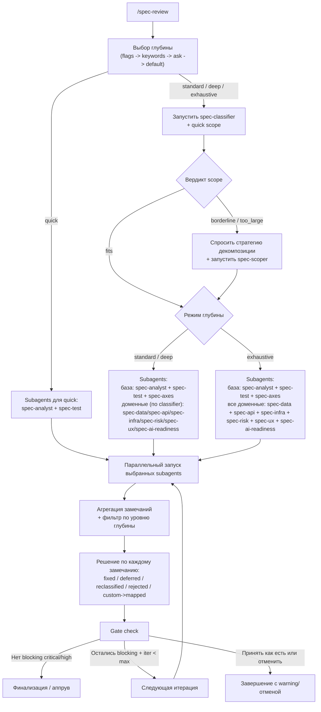
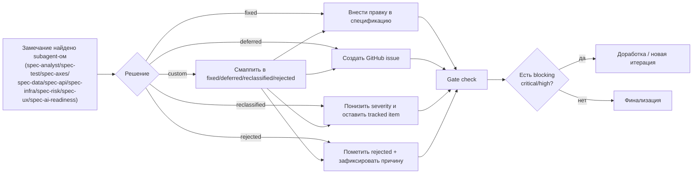

# spec-reviewer

Плагин ревью спецификаций для Claude Code.
Помогает находить гапы, противоречия, неоднозначности, проблемы тестируемости и риски scope до начала реализации.

English version: [README.md](./README.md)

## Почему использовать

Используй `spec-reviewer`, когда нужно:
- уменьшить объём переделок до старта разработки,
- рано найти блокеры (замечания `critical/high`),
- разбить слишком большую спецификацию на реализуемые фазы,
- сохранить прозрачный decision trail по каждому замечанию.

## Установка

```bash
/plugin install spec-reviewer@dapi
```

## Быстрый старт

```bash
/spec-reviewer:spec-review [--quick|-q|--standard|-s|--deep|-d|--exhaustive|-e|--no-ask] [Google Doc URL | GitHub Issue URL | Docmost URL | file path]
/spec-review docs/spec.md
/spec-review --quick #42
/spec-review --deep https://docs.google.com/document/d/<DOC_ID>/edit
/spec-review --standard https://docs.company.com/p/<PAGE_ID>
```

## Объяснение аргументов команды

Форма команды:

```text
/spec-reviewer:spec-review [depth flag] [--no-ask] [source]
```

Приоритет определения глубины:
1. явный флаг глубины (`--quick/--standard/--deep/--exhaustive`);
2. ключевые слова глубины в сообщении;
3. интерактивный вопрос о глубине;
4. fallback в `standard`.

### Флаги

| Флаг | Что делает | Когда использовать |
|---|---|---|
| `--quick`<br/>`-q` | Быстрая проверка блокеров. Показывает только `critical`, пропускает classifier и gate-check, запускает только `spec-analyst` + `spec-test`. | Быстрый pre-check перед стартом разработки. |
| `--standard`<br/>`-s` | Сбалансированный режим по умолчанию. Показывает `critical` + `high`, использует classifier и gate-check. | Ежедневный рабочий режим ревью. |
| `--deep`<br/>`-d` | Более широкий обзор. Та же стратегия агентов, что в Standard, но включает `medium`. | Перед релизом и для рискованных изменений. |
| `--exhaustive`<br/>`-e` | Полный аудит. Включает `low`, принудительно запускает все доменные агенты, classifier оставляет для оценки scope. | Крупные архитектурные/интеграционные этапы. |
| `--no-ask` | Не задавать интерактивный вопрос «какой уровень?». Если явный флаг глубины не задан, сразу запускается `standard`. | CI/non-interactive запуск, скрипты. |

Примечания про `--no-ask`:
- Влияет только на UX выбора глубины (убирает вопрос).
- Это не автопилот и не авто-редактирование спецификации.
- Если передан явный флаг глубины (например `--deep --no-ask`), используется именно он.

## Режим автопилота (self-loop)

Отдельного флага `--autopilot` нет. Для максимально автоматического цикла используй такой рецепт:

1. Запуск с максимальным покрытием и без вопроса о глубине:

```bash
/spec-reviewer:spec-review --exhaustive --no-ask <source>
```

2. В шагах аппрува/gate-check выбирай `custom` (своя стратегия) и задай политику:

```text
Политика автопилота:
- Обрабатывать все замечания автоматически.
- Если правка безопасна, применять fixed.
- Если безопасно не исправить автоматически, ставить deferred и создавать tracking issue.
- Для deferred/reclassified/rejected всегда фиксировать rationale.
- После обработки запускать полный re-analysis.
- Повторять цикл, пока не останется blocking critical/high.
```

3. Для строгого self-loop «до нуля»:
- Добавь правило «повторять, пока critical/high/medium/low = 0».
- Если достигнут лимит итераций в одном запуске, запусти команду повторно с той же политикой.

Что здесь означает автопилот:
- автоматическая обработка замечаний + повторный анализ;
- но всё равно policy-driven режим, а не слепой auto-merge всех изменений.

### Аргумент источника

`[source]` — один опциональный позиционный аргумент:

| Источник | Поддерживаемый формат | Пример |
|---|---|---|
| Google Doc | полный URL Google Docs | `https://docs.google.com/document/d/<DOC_ID>/edit` |
| GitHub Issue | полный URL issue или короткий `#number` | `https://github.com/org/repo/issues/42`, `#42` |
| Docmost page | URL страницы Docmost | `https://docs.company.com/p/<PAGE_ID>` |
| Локальный файл | относительный или абсолютный путь | `docs/spec.md` |

Если `[source]` не указан, можно вставить текст спецификации прямо в чат и запускать ревью по этому тексту.

## Поддерживаемые источники

- Google Docs URL
- GitHub Issue URL или `#number`
- URL страницы Docmost (чтение через MCP Docmost)
- локальный путь к файлу
- большой текст спецификации, вставленный в чат

## Уровни ревью

| Уровень | Флаги | Видимая severity (фокус) | Classifier | Стратегия агентов | Gate Check | Макс. итераций |
|---|---|---|---|---|---|---|
| Quick | `--quick`<br/>`-q` | только `critical` (blockers) | пропускается | только `spec-analyst` + `spec-test` | нет | 1 |
| Standard (default) | `--standard`<br/>`-s` | `critical`, `high` | да | база + `spec-axes` + доменные по classifier (+`spec-scoper` при необходимости) | да | 2 |
| Deep | `--deep`<br/>`-d` | `critical`, `high`, `medium` | да | как Standard, но шире окно отчёта | да | 3 |
| Exhaustive | `--exhaustive`<br/>`-e` | всё, включая `low` | да (только для scope) | база + `spec-axes` + все доменные (+`spec-scoper` при необходимости) | да | 3 |

Поведение `--no-ask` подробно описано в разделе **Объяснение аргументов команды**.

### Что меняется между уровнями

Таблица выше в одном месте фиксирует порог severity, лимит итераций, использование classifier и стратегию subagents.

### Логика комбинации подскиллов

Базовый набор (всегда в non-classifier фазе):
- `spec-analyst`
- `spec-test`

Добавляется в `standard/deep/exhaustive`:
- `spec-axes` (покрытие What/How/Verify)

Доменные агенты:
- `standard/deep`: выбираются `spec-classifier` по содержимому спеки;
- `exhaustive`: запускаются все доменные агенты (`spec-data`, `spec-api`, `spec-infra`, `spec-risk`, `spec-ux`, `spec-ai-readiness`).

Scope-агент:
- `spec-scoper` запускается при `quick_scope = borderline | too_large`.

### Практическая разница (примеры)

1. Quick для UI-heavy спеки:
- запускает только `spec-analyst` + `spec-test` для блокеров;
- самый быстрый режим, но без глубоких доменных проверок UX/infra/API.

2. Standard для типовой продуктовой спеки:
- обычно это `analyst + test + axes`, плюс релевантные доменные агенты;
- оптимальный default для sprint planning.

3. Exhaustive перед высокорисковым релизом:
- принудительно покрывает все домены независимо от classifier;
- подходит перед architecture freeze и крупными интеграциями.

## Диаграмма процесса ревью



## Короткая диаграмма жизненного цикла замечания



## Компоненты

### Команда: `/spec-review`

Главная оркестрационная команда. Выполняет многофазный поток:
1. определяет глубину,
2. читает источник спецификации,
3. классифицирует нужных агентов,
4. запускает параллельный анализ,
5. агрегирует замечания,
6. обрабатывает решения,
7. выполняет gate-check и финализацию.

### Skill: `spec-review`

Auto-router skill, который срабатывает на запросы вида:
- "review spec",
- "check the specification",
- "find inconsistencies in requirements",
- и аналогичные intent-ы ревью требований.

## Подскиллы (агенты)

`spec-reviewer` включает 11 специализированных агентов:

| Агент | Роль | Когда запускается |
|---|---|---|
| `spec-classifier` | Определяет, каких агентов запускать + quick оценка scope | standard/deep/exhaustive |
| `spec-analyst` | Качество бизнес-требований | всегда |
| `spec-test` | Тестируемость и edge-cases | всегда |
| `spec-axes` | Покрытие по осям What/How/Verify | standard/deep/exhaustive |
| `spec-data` | Ревью моделей данных/схем/миграций | условно |
| `spec-api` | Ревью API/контрактов/интеграций | условно |
| `spec-infra` | Ревью безопасности/NFR/deployment | условно |
| `spec-risk` | Ревью тех/бизнес/сроковых рисков | условно |
| `spec-ux` | UX-состояния, флоу, accessibility | условно |
| `spec-ai-readiness` | Готовность к исполнению AI-агентами | условно |
| `spec-scoper` | Детальная декомпозиция большого scope | при borderline/too_large |

Примечание:
- В parallel-фазе команда запускает от 2 до 10 агентов.
- `spec-classifier` выполняется раньше как отдельная фаза.

## Отдельный запуск подскиллов (advanced)

Основной путь использования — `/spec-review`.

Если нужен узконаправленный анализ, можно вызвать конкретный subagent напрямую через Task:

```text
Task:
  subagent_type: "spec-reviewer:spec-api"
  description: "API-only review"
  prompt: |
    Analyze this spec for API contracts, endpoints, and integration risks.
    Return JSON only.
```

Частые standalone-цели:
- `spec-reviewer:spec-data`
- `spec-reviewer:spec-api`
- `spec-reviewer:spec-infra`
- `spec-reviewer:spec-risk`
- `spec-reviewer:spec-ux`
- `spec-reviewer:spec-ai-readiness`
- `spec-reviewer:spec-scoper`

## Логика обработки замечаний

Для каждого замечания выбирается один путь:

1. `fixed`
- принято и применено к исходной спецификации.

2. `deferred`
- вынесено в отдельный GitHub issue/sub-issue на более позднее выполнение.

3. `reclassified`
- severity понижается (с rationale), например с `high` до `medium`.
  Значение severity у самого issue должно быть обновлено.

4. `rejected`
- замечание явно отклонено (с rationale) и задокументировано в артефактах ревью.

5. `custom`
- пользовательская стратегия, которая затем маппится в один из статусов:
  `fixed | deferred | reclassified | rejected`.

### Reclassified vs Rejected

- `reclassified` означает, что замечание остаётся валидным, но больше не считается блокером на текущем gate-уровне. Оно может появляться в более глубоких отчётах и остаётся в истории.
- `rejected` означает, что команда решила не выполнять это замечание. Оно больше не должно блокировать gate-check, но причина отклонения должна оставаться зафиксированной.
- Блокерами в gate-check считаются только нерешённые `critical/high`. Статусы `fixed`, `deferred`, `rejected` gate-check не блокируют.

Правило для NFR:
- если NFR релиз-критичный (security/compliance/SLO contract), **не** использовать `reclassified`; использовать `fixed` (или явно `deferred` с блокировкой релиза);
- `reclassified` использовать только когда влияние принято для текущего milestone и rationale задокументирован.

### Где фиксируются решения

- в отчёте/результате ревью,
- в комментариях/заметках к спецификации,
- в GitHub issues (для deferred),
- в истории замечаний между итерациями.

## Логика разбиения scope

Если quick scope даёт `borderline` или `too_large`, `spec-scoper` предлагает:
- фазное разбиение (`PART-001`, `PART-002`, ...),
- граф зависимостей,
- что остаётся в текущем scope и что выносится в подзадачи.

Это позволяет безопасно доставлять изменения по частям вместо одного oversized-батча.

## Примеры сценариев

1. Gate для sprint planning
- Запусти `--standard` на новом PRD/ТЗ до начала инженерной реализации.
- Исправь critical/high, неблокирующее отложи.

2. High-risk интеграционный релиз
- Запусти `--exhaustive` для payment/auth/third-party integration спеки.
- Сфокусируйся на выводах API, infra, risk и testability.

3. Декомпозиция слишком большой фичи
- Запусти ревью для крупного epic.
- Прими разбиение от `spec-scoper` и создай фазные sub-issues.

4. Проект с AI-автоматизацией
- Запусти с включённым AI-readiness.
- Проверь, что явно описаны границы, точки эскалации и критерии успеха.

## Best Practices

- Делай acceptance criteria измеримыми.
- Закрывай critical/high до аппрува на реализацию.
- Используй `deferred` только с созданными tracking issues.
- Требуй rationale для `reclassified` и `rejected`.
- Для `borderline/too_large` предпочитай фазную delivery-модель.

## FAQ

**Этот скилл проверяет непротиворечивость?**

Да. Проверка непротиворечивости — одна из базовых задач ревью:
- `spec-analyst` проверяет бизнес-противоречия (`stories ↔ AC`, правила, scope vs goals).
- `spec-data`, `spec-api` и `spec-infra` проверяют техническую согласованность моделей данных, API-контрактов и NFR/security допущений.
- `spec-test` и `spec-axes` выявляют неоднозначности и рассинхрон требований, которые приводят к конфликтующим интерпретациям в реализации и тестировании.

## Документация

- [Workflow команды](./commands/spec-review.md)
- [Описание skill](./skills/spec-review/SKILL.md)
- [Альтернативы и смежные скиллы](./ALTERNATIVES.md)

## Лицензия

MIT
