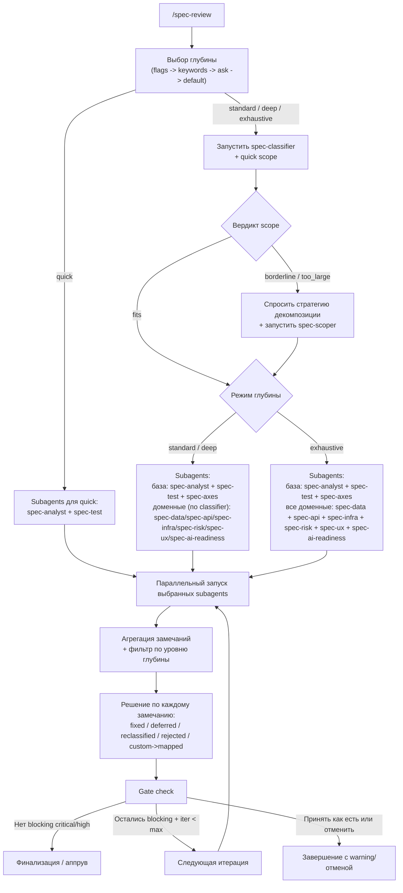
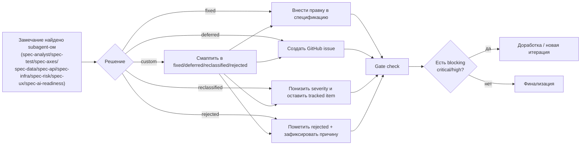

# spec-reviewer

Плагин ревью спецификаций для Claude Code.
Ищет гапы, противоречия, неоднозначности, проблемы тестируемости и риски scope до начала реализации.

## Установка

```bash
/plugin install spec-reviewer@dapi
```

## Быстрый старт

```bash
/spec-review docs/spec.md
/spec-review --quick #42
/spec-review --deep https://docs.google.com/document/d/<DOC_ID>/edit
/spec-review --standard https://docs.company.com/p/<PAGE_ID>
```

## Поддерживаемые источники

- Google Docs URL
- GitHub Issue URL или `#number`
- URL страницы Docmost (чтение приоритетно через MCP Docmost)
- локальный путь к файлу
- вставленный в чат текст спецификации

## Уровни ревью: чем отличаются

| Уровень | Флаги | Что показываем | Classifier | Стратегия агентов | Gate Check | Итераций |
|---|---|---|---|---|---|---|
| Quick | `--quick`, `-q` | только `critical` | пропускается | только `spec-analyst` + `spec-test` | нет | 1 |
| Standard (default) | `--standard`, `-s` | `critical` + `high` | да | базовые + `spec-axes` + условные доменные (+`spec-scoper` при необходимости) | да | 2 |
| Deep | `--deep`, `-d` | `critical` + `high` + `medium` | да | как в Standard, но с более широким окном severity | да | 3 |
| Exhaustive | `--exhaustive`, `-e` | полный аудит, включая `low` | да (только для scope) | базовые + `spec-axes` + все доменные (+`spec-scoper` при необходимости) | да | 3 |

Дополнительно:
- `--no-ask` — пропустить вопрос выбора уровня и сразу запускать `standard`.
  Это не режим автопилота: спецификация не меняется сама.

### Что именно меняется между уровнями

Таблица выше уже объединяет все параметры: порог severity, число итераций, classifier, gate-check и стратегию подскиллов.

### Комбинация подскиллов

База:
- `spec-analyst`
- `spec-test`

Начиная со Standard:
- `spec-axes`

Доменные агенты:
- в `standard/deep` выбираются classifier-ом по содержимому спеки;
- в `exhaustive` включаются все: `spec-data`, `spec-api`, `spec-infra`, `spec-risk`, `spec-ux`, `spec-ai-readiness`.

`spec-scoper`:
- включается при `borderline` или `too_large`.

## Диаграмма процесса ревью



## Короткая диаграмма жизненного цикла замечания



## Агенты

| Агент | Назначение |
|---|---|
| `spec-classifier` | маршрутизация агентов + quick оценка объёма |
| `spec-analyst` | бизнес-логика, AC, роли |
| `spec-test` | тестируемость и edge-cases |
| `spec-axes` | покрытие по осям What/How/Verify |
| `spec-data` | модели данных и миграции |
| `spec-api` | API/контракты/интеграции |
| `spec-infra` | security/NFR/deploy |
| `spec-risk` | тех/бизнес/операционные риски |
| `spec-ux` | UX/UI состояния и флоу |
| `spec-ai-readiness` | готовность спецификации для AI-агентов |
| `spec-scoper` | декомпозиция большого scope |

## Документация

- [Workflow команды](./commands/spec-review.md)
- [Описание skill](./skills/spec-review/SKILL.md)
- [Альтернативы](./ALTERNATIVES.md)

## Лицензия

MIT
